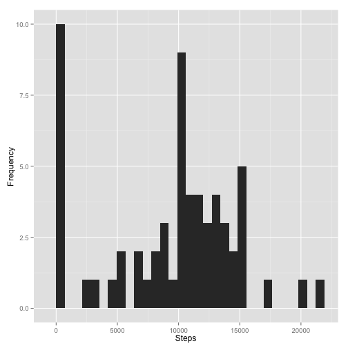
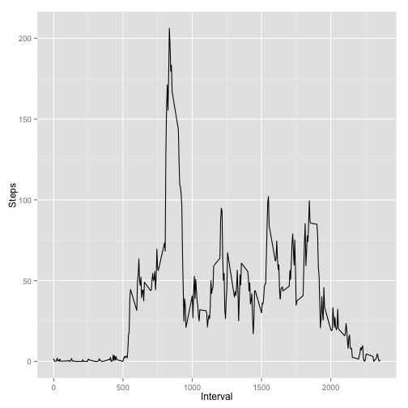
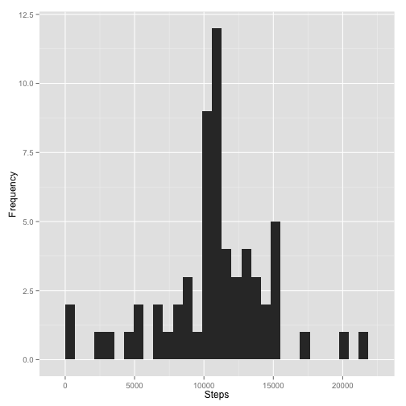
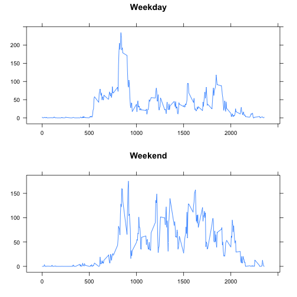

Reproducible Research Assignment One
====================================

## Introduction

This document shows the analysis & results of personal activity monitoring device data.

**Four questions will be answered:**

1. What are the mean steps taken each day?
2. What is the average daily acitivty pattern?
3. How do the results to the above two questions change when missing data is imputed?
4. Do activity patterns change between weekends & weekdays?

### Setup

First, we clear the global environment


```r
rm(list = ls())
```

The following packages will be loaded. If they are not available, an error is produced.


```r
require(ggplot2)
require(dplyr)
require(plyr)
require(data.table)
require(lattice)
require(gridExtra)
```

Now we load the required data. If it cannot be found in the current working directory, it will be downloaded.


```r
if( !file.exists("activity.csv") ) {
  download.file("https://d396qusza40orc.cloudfront.net/repdata%2Fdata%2Factivity.zip",            
                destfile = "activity.zip", method = "curl")
  unzip("activity.zip")
} else {
  print("Data exists!")
}
```

```
## [1] "Data exists!"
```

Load the data file into a data frame. Print the head.


```r
dat <- read.csv("activity.csv")
head(dat)
```

```
##   steps       date interval
## 1    NA 2012-10-01        0
## 2    NA 2012-10-01        5
## 3    NA 2012-10-01       10
## 4    NA 2012-10-01       15
## 5    NA 2012-10-01       20
## 6    NA 2012-10-01       25
```

### Question 1. What are the mean steps taken each day?

Create a data frame of the sum of column steps by date using the plyr package.


```r
data <- ddply(dat, .(date), summarise, steps = sum(steps, na.rm=TRUE))
head(data)
```

```
##         date steps
## 1 2012-10-01     0
## 2 2012-10-02   126
## 3 2012-10-03 11352
## 4 2012-10-04 12116
## 5 2012-10-05 13294
## 6 2012-10-06 15420
```

Create a histogram using ggplot2.


```r
qplot(data$steps,
      xlab = "Steps",
      ylab = "Frequency",
      geom = "histogram")
```

 

Print the mean & median of the number of steps taken, per day.


```r
summary(data$steps)
```

```
##    Min. 1st Qu.  Median    Mean 3rd Qu.    Max. 
##       0    6778   10400    9354   12810   21190
```

### Question 2. What is the average daily acitivty pattern?

Create a data frame of the mean of column steps by interval using the plyr package.


```r
data <- ddply(dat, .(interval), summarise, steps = mean(steps, na.rm=TRUE))
head(data)
```

```
##   interval     steps
## 1        0 1.7169811
## 2        5 0.3396226
## 3       10 0.1320755
## 4       15 0.1509434
## 5       20 0.0754717
## 6       25 2.0943396
```

Create a line graph using ggplot2.


```r
qplot(data$interval, data$steps,
      xlab = "Interval",
      ylab = "Steps",
      geom = "Line")
```

 

Interval **835** averages the most number of steps taken.

### Question 3. How do the results to the above two questions change when missing data is imputed?

Create a new data frame with the average time of each interval.


```r
avg <- aggregate(. ~ interval, dat, FUN = mean, na.rm=TRUE)
```

Merge the new data frame with the interval averages with the complete data frame.


```r
joindat <- join(dat, avg, by = "interval", type="left", match="all")
joindat[[5]] <- NULL
colnames(joindat)[4] <- "avgsteps"
```

Replace NA values with imputed average step values

```r
joindat$steps[is.na(joindat$steps)] <- joindat$avgsteps[is.na(joindat$steps)]
joindat[[4]] <- NULL
```

Create a summary data frame of averages.


```r
data <- ddply(joindat, .(date), summarise, steps = sum(steps))
head(data)
```

```
##         date    steps
## 1 2012-10-01 10766.19
## 2 2012-10-02   126.00
## 3 2012-10-03 11352.00
## 4 2012-10-04 12116.00
## 5 2012-10-05 13294.00
## 6 2012-10-06 15420.00
```

Create a histogram using ggplot2. Notice that the most frequent number of steps taken changes dramatically from 0 in Question 1. to the ~mean (10,770) here.


```r
qplot(data$steps,
      xlab = "Steps",
      ylab = "Frequency",
      geom = "histogram")
```

 

Print the mean & median of the number of steps taken, per day.


```r
summary(data$steps)
```

```
##    Min. 1st Qu.  Median    Mean 3rd Qu.    Max. 
##      41    9819   10770   10770   12810   21190
```

### Question 4. Do activity patterns change between weekends & weekdays?

Format the date column. Add a new column with the day of week. Replace weekdays with "weekday" & weekends with "weekend"


```r
dat$date <- as.Date(dat$date, "%Y-%m-%d") 
dat$day <- weekdays(dat$date)
dat$day <- gsub("Monday", "weekday", dat$day)
dat$day <- gsub("Tuesday", "weekday", dat$day)
dat$day <- gsub("Wednesday", "weekday", dat$day)
dat$day <- gsub("Thursday", "weekday", dat$day)
dat$day <- gsub("Friday", "weekday", dat$day)
dat$day <- gsub("Saturday", "weekend", dat$day)
dat$day <- gsub("Sunday", "weekend", dat$day)
```

Create two new data frames, with averages of weekend & weekday data. Then create summary tables of the two data frames.


```r
weekday <- dat[dat$day == "weekday",]
weekend <- dat[dat$day == "weekend",]
weekdaysum <- ddply(weekday, .(interval), summarise, steps = mean(steps, na.rm=TRUE))
weekendsum <- ddply(weekend, .(interval), summarise, steps = mean(steps, na.rm=TRUE))
```

Use the lattice system to create two graphs.


```r
par(mfrow=c(1,2))
p1 <- xyplot(weekdaysum$steps ~ weekdaysum$interval, type="l", main="Weekday",xlab="",ylab="")
p2 <- xyplot(weekendsum$steps ~ weekendsum$interval, type="l",main="Weekend",xlab="",ylab="")
grid.arrange(p1,p2,ncol=1)
```

 
